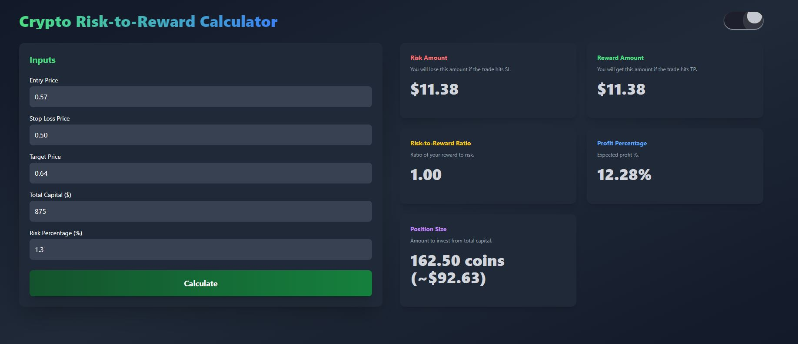

# Crypto Risk-to-Reward Calculator


## Live Demo

Access the live version of the project: [Netlify Link](https://cryptotradecalculator.netlify.app/){:target="_blank"}

This project is deployed and hosted on Netlify. Click the link above to explore the live version.

---

## Overview

This project is a **responsive and interactive Crypto Risk-to-Reward Calculator** built with Angular and Tailwind CSS. It allows traders to compute essential metrics like risk amount, reward amount, and profit percentage, making it a valuable tool for cryptocurrency traders. The application is designed to be user-friendly and visually appealing, catering to both desktop and mobile users.

---

## Features

- **Dynamic Theme Support**: Switch between dark mode and light mode for optimal viewing.
- **Responsive Design**: Ensures a seamless user experience on all devices, from desktops to mobile phones.
- **Real-Time Calculations**: Automatically calculates:
  - Risk Amount
  - Reward Amount
  - Risk-to-Reward Ratio
  - Profit Percentage
  - Position Size
- **Validation Alerts**: Highlights empty or invalid fields with red borders for better input accuracy.
- **Smooth Scrolling**: Scrolls smoothly to the results section after calculations on mobile devices.
- **Customizable Inputs**: Easily adjust trading parameters such as entry price, stop-loss price, and total capital.

---

## Technologies Used

- **Angular**: Framework for building the application.
- **Tailwind CSS**: For styling and responsive design.
- **HTML & TypeScript**: Core languages for structure and functionality.
- **Visual Studio Code (VSCode)**: Code editor used to develop the project.

---

## Getting Started

To view the Crypto Risk-to-Reward Calculator, follow these steps:

1. Clone the repository to your local machine or download the ZIP file.  
2. Open the project folder in your preferred code editor, such as Visual Studio Code.  
3. Install the project dependencies:
   ```bash
   npm install
4. Run the development server:
   ```bash
   ng serve

5. Open the application in your browser:
   ```bash
   http://localhost:4200

## Project Structure
crypto-risk-reward-calculator/
|-- src/  
|   |-- app/  
|   |   |-- components/  
|   |   |   |-- main-page/  
|   |   |       |-- main-page.component.html  
|   |   |       |-- main-page.component.ts  
|   |   |       |-- main-page.component.css  
|   |-- assets/  
|   |   |-- public/  
|   |       |-- thumnail.JPG  
|-- angular.json  
|-- package.json  
|-- README.md  
  

**main-page.component.html**: Contains the HTML structure of the main page.
**main-page.component.ts**: Includes the logic for calculations and theme toggling.
**main-page.component.css**: Styles specific to the component.


### Contributing
If you have any suggestions or improvements for the Crypto Risk-to-Reward Calculator, feel free to fork the repository, make your changes, and submit a pull request.


### License
This project is licensed under the MIT License.

## Contact
For any inquiries or feedback, please contact Saadat Ali at **sadiraja500@gmail.com**

Thank you for checking out the watch product landing page project! We hope you enjoy exploring the features of our stylish watch product.
